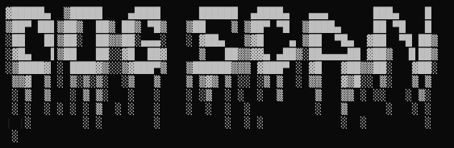
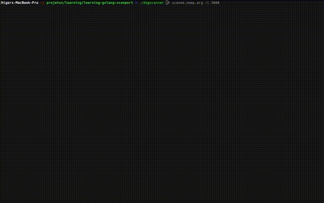
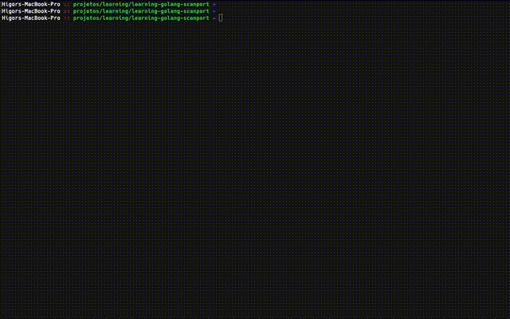

# Dogscanner



 Projeto foi criado com intuito de criação de uma sniffer de portas abertas em
 servidores internos.

## Manual

Para utilização dos software segue a descrição abaixo.



Para utilização da ferramenta necessita-se de alguns parâmetros, que são:

- [x] Para host informar ```-h``` 
- [x] Para o limite de portas scaneadas informar ```-l```


Segue o exemplo abaixo:

#### Baixando o repositório.

```sh
git clone git@github.com:higordiego/learning-golang-scanport.git
```

#### Gerando build para o seu sistema operacional.

```sh
go build -o goscanner
```

#### Iniciando o programa.

```sh
./goscanner -h scanme.nmap.org -l 3000
```



# License
© Feito com muito &#10084; por [Higor Diego](https://www.linkedin.com/in/higordiego/) 🤝


